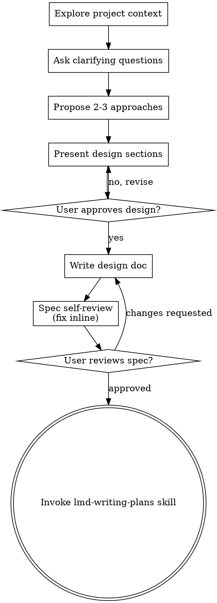

@lean-md
consumer: ai

@phase "pre-context"
@include hard-rules
@include brainstorm-gate

## Brainstorming Ideas Into Designs

Help turn ideas into fully formed designs and specs through natural collaborative
dialogue. Start by understanding the current project context, then ask questions
one at a time to refine the idea. Once you understand what you're building,
present the design and get user approval.

## Checklist

You MUST create a task for each of these items and complete them in order:

1. **Explore project context** — check files, docs, recent commits
2. **Offer the visual companion just-in-time** — NOT upfront. The first time a
   question would genuinely be clearer shown than described, offer it then (its
   own message). On approval, render the companion:
   `ctx_md_render(skill="lmd-brainstorm", companion="visual-companion")`. If no
   visual question ever arises, never offer it.
3. **Ask clarifying questions** — one at a time, understand
   purpose/constraints/success criteria
4. **Propose 2-3 approaches** — with trade-offs and your recommendation
5. **Present design** — in sections scaled to their complexity, get user approval
   after each section
6. **Write design doc** — save to `docs/specs/YYYY-MM-DD-<topic>-design.md` (user
   preferences for spec location override this default) and commit
7. **Spec self-review** — quick inline check for placeholders, contradictions,
   ambiguity, scope
8. **User reviews written spec** — ask user to review the spec file before
   proceeding
9. **Transition to implementation** — invoke the lmd-writing-plans skill to create
   the implementation plan

## Process Flow

**The terminal state is invoking lmd-writing-plans.** Do NOT invoke any
implementation skill. The ONLY skill you invoke after brainstorming is
lmd-writing-plans.

## Key Principles

- **One question at a time** — Don't overwhelm with multiple questions
- **Multiple choice preferred** — Easier to answer than open-ended when possible
- **YAGNI ruthlessly** — Remove unnecessary features from all designs
- **Explore alternatives** — Always propose 2-3 approaches before settling
- **Incremental validation** — Present design, get approval before moving on
- **Be flexible** — Go back and clarify if something doesn't make sense

next: render phase "explore".
@phase-end

@phase "explore"
@include brainstorm-gate

## Understanding the idea

- Check out the current project state first (files, docs, recent commits).
- Before asking detailed questions, assess scope: if the request describes
  multiple independent subsystems (e.g., "build a platform with chat, file
  storage, billing, and analytics"), flag this immediately. Don't spend questions
  refining details of a project that needs to be decomposed first.
- If the project is too large for a single spec, help the user decompose into
  sub-projects: what are the independent pieces, how do they relate, what order
  should they be built? Then brainstorm the first sub-project through the normal
  design flow. Each sub-project gets its own spec -> plan -> implementation cycle.
- For appropriately-scoped projects, move on to clarifying questions.

next: render phase "questions".
@phase-end

@phase "questions"
@include brainstorm-gate

## Ask clarifying questions

- Ask questions one at a time to refine the idea.
- Prefer multiple choice questions when possible, but open-ended is fine too.
- Only one question per message — if a topic needs more exploration, break it into
  multiple questions.
- Focus on understanding: purpose, constraints, success criteria.
- YAGNI ruthlessly — surface and remove unnecessary features as they come up.

**Visual companion — offer just-in-time (its own message):** do NOT offer it
upfront. Wait until a question would genuinely be clearer shown than told — a real
mockup / layout / diagram question, not merely a UI *topic*. The first time that
happens, offer it then, as its own message — only the offer, no clarifying
question or other content. If the user accepts, render the detailed guide:
`ctx_md_render(skill="lmd-brainstorm", companion="visual-companion")`. If they
decline, continue text-only and don't offer again unless they raise it.

next: render phase "approaches".
@phase-end

@phase "approaches"
@include brainstorm-gate

## Propose 2-3 approaches

- Propose 2-3 different approaches with trade-offs.
- Present options conversationally with your recommendation and reasoning.
- Lead with your recommended option and explain why.

next: render phase "present-design".
@phase-end

@phase "present-design"
@include brainstorm-gate

## Presenting the design

- Once you believe you understand what you're building, present the design.
- Scale each section to its complexity: a few sentences if straightforward, up to
  200-300 words if nuanced.
- Ask after each section whether it looks right so far.
- Cover: architecture, components, data flow, error handling, testing.
- Be ready to go back and clarify if something doesn't make sense.

## Design for isolation and clarity

- Break the system into smaller units that each have one clear purpose,
  communicate through well-defined interfaces, and can be understood and tested
  independently.
- For each unit, you should be able to answer: what does it do, how do you use it,
  and what does it depend on?
- Can someone understand what a unit does without reading its internals? Can you
  change the internals without breaking consumers? If not, the boundaries need work.
- Smaller, well-bounded units are also easier for you to work with — you reason
  better about code you can hold in context at once, and your edits are more
  reliable when files are focused. When a file grows large, that's often a signal
  that it's doing too much.

## Working in existing codebases

- Explore the current structure before proposing changes. Follow existing patterns.
- Where existing code has problems that affect the work (a file that's grown too
  large, unclear boundaries, tangled responsibilities), include targeted
  improvements as part of the design — the way a good developer improves code they
  are working in.
- Don't propose unrelated refactoring. Stay focused on what serves the current goal.

**Per-question browser-vs-terminal:** even after the user accepts the visual
companion, decide FOR EACH question whether to use the browser or the terminal —
the test is "would the user understand this better by seeing it than reading it?"
(see the `visual-companion` companion).

next: render phase "write-spec".
@phase-end

@phase "write-spec"

## Documentation

- Write the validated design (spec) to `docs/specs/YYYY-MM-DD-<topic>-design.md`.
  (User preferences for spec location override this default.)
- Write the spec clearly and concisely — tight prose, no filler.
- Persist the key design decisions as durable facts, then commit the design
  document to git.

next: render phase "self-review".
@phase-end

@phase "self-review"

## Spec Self-Review

After writing the spec document, look at it with fresh eyes:

1. **Placeholder scan:** Any "TBD", "TODO", incomplete sections, or vague
   requirements? Fix them.
2. **Internal consistency:** Do any sections contradict each other? Does the
   architecture match the feature descriptions?
3. **Scope check:** Is this focused enough for a single implementation plan, or
   does it need decomposition?
4. **Ambiguity check:** Could any requirement be interpreted two different ways?
   If so, pick one and make it explicit.

Fix any issues inline. No need to re-review — just fix and move on.

For an independent second pass, dispatch the spec-reviewer subagent (its brief is
the reviewer companion; the dispatch contract is auto-prepended):

@dispatch skill="lmd-brainstorm" companion="spec-reviewer" role=review to_agent="{{ controller_id }}"

The reviewer checks `SPEC_FILE_PATH`, posts findings, and returns a status
(`Approved | Issues Found`).

## User Review Gate

After the spec review passes, ask the user to review the written spec before
proceeding:

> "Spec written and committed to `<path>`. Please review it and let me know if you
> want to make any changes before we start writing out the implementation plan."

Wait for the user's response. If they request changes, make them and re-run the
spec review. Only proceed once the user approves.

next: render phase "handoff".
@phase-end

@phase "handoff"

## Implementation handoff

- The terminal state of brainstorming is invoking the lmd-writing-plans skill to
  create a detailed implementation plan from the approved spec.
- Do NOT invoke any other skill. lmd-writing-plans is the next step.

This is the terminal phase — there is no "next" render.
@phase-end
